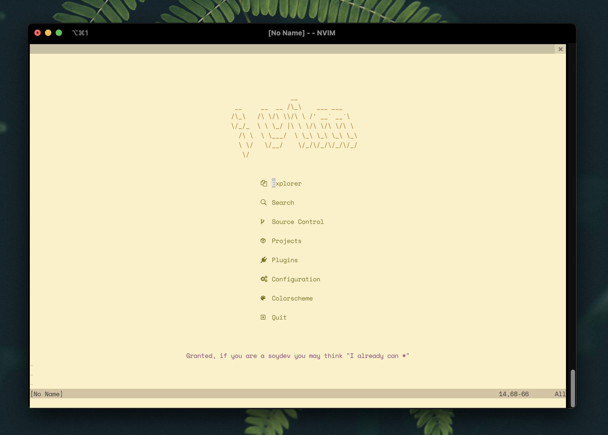

<pre align="center">
                                   
                __                 
 __     __  __ /\_\    ___ ___     
/\_\   /\ \/\ \\/\ \ /' __` __`\   
\/_/_  \ \ \_/ |\ \ \/\ \/\ \/\ \  
  /\ \  \ \___/  \ \_\ \_\ \_\ \_\ 
  \ \/   \/__/    \/_/\/_/\/_/\/_/ 
   \/                              
                                   
                                   
</pre>

> my personal neovim text editor configuration

